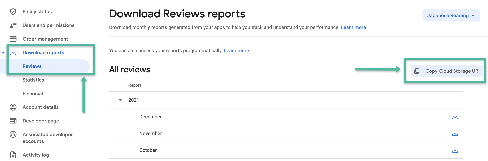
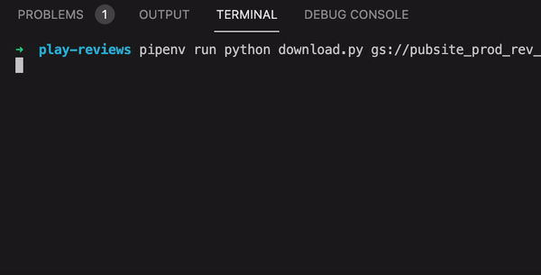

# google play download script

In the Google Play web console you can download reviews for each month but if you want to get all the reviews ever, well, it becomes a bit more complicated.

This script helps connect to a google bucket, list all the existing files, download them and then join them into one single CSV file.

## bucket url

First thing you need to do is to find your bucket URL, this is easy to do in the [Google Play Console](https://play.google.com/console/u/0/developers/) under the reports page:



## usage

You'll need to be logged in with [gcloud](https://cloud.google.com/sdk/gcloud/reference/auth) to run this script.

```
gcloud auth login
pipenv install
pipenv run python download.py gs://pubsite_prod_rev_**************/reviews/
```

## example

